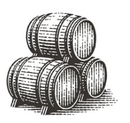
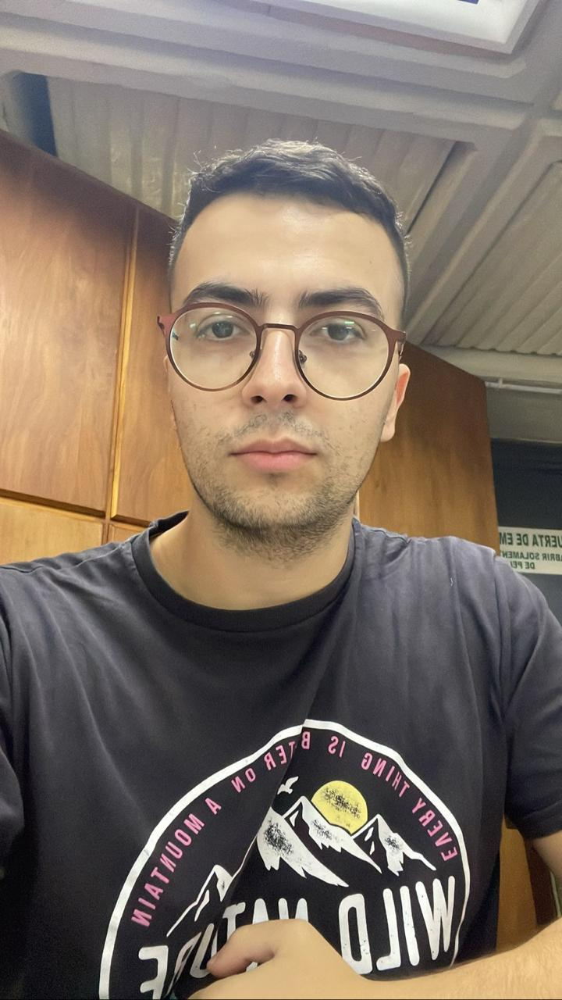

# Modulo1
Técnicas y Herramientas modernas. Grupo: Ecuacionistas

<html>

	<head>

		<h1>Proyecto El Gato </h1> 
 
	</head>

		<body>
			<h2>Tecnología Bodeguera</h2> 

			El vídeo proporciona una manera eficaz para ayudarle a demostrar el punto. Cuando haga clic en Vídeo en línea, puede pegar el código para insertar del vídeo que desea agregar. También puede escribir una palabra clave para buscar en línea el vídeo que mejor se adapte a su documento.

<h3> Integrantes del grupo </h3>
<ul> 

<table>
<tr>
<td>
 

<li> Leandro  Ferrando Bustos </li>
<li> <a href="mailto:ferrandoe99@gmail.com">Enviar correo</a> </li>

</td>

<td>

</td>
<td>

</td>
<td>

</td>
<td>

</td>

<td>

<li> Joaquín Hidalgo </li>
<li> <a href="mailto:joso.hidalgo2000@gmail.com">Enviar correo</a> </li>

</td>

</td>
<td>

</td>
<td>

</td>
<td>

</td>
<td>

</td>

<td>

<li> Bautista Coppede Santos </li>
<li> <a href="mailto:bauticoppede@hotmail.com">Enviar correo</a> </li>

</td>

</td>
<td>

</td>
<td>

</td>
<td>

</td>
<td>

</td>

<td>

<li> Augusto Salvatierra </li>
<li> <a href="mailto:saugusto16@gmail.com">Enviar correo</a> </li>

</td> 

</td>
<td>

</td>
<td>

</td>
<td>

</td>
<td>

</td>

</tr>
     </table>
    

<a href="https://github.com/Ecuacionistas">Situp de GitHub </a>

		</body>

</html>
